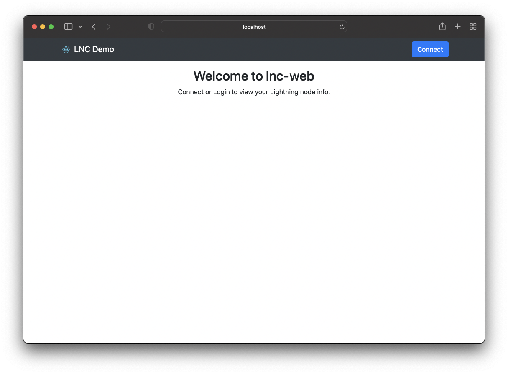

# LNC Demo - Basic Connect

This demo showcases the most basic flow to connect from a browser to a Lightning Terminal
(litd) node using the `lnc-web` NPM package.

## Running the demo

To run the demo, you'll need to have NodeJS installed and a Lightning Terminal node
accessible that you can obtain a pairing phrase from.

1. Clone this repo
   ```sh
   $ git clone https://github.com/lightninglabs/lnc-web.git
   $ cd lnc-web/demos/connect-demo
   ```
2. Install the dependencies
   ```sh
   $ npm install
   ```
3. Start the web app
   ```sh
   $ npm start
   ```
   Your browser should open to http://localhost:3000 and you will see the home page.

## LNC Relevant Code

The `LNC` object in this app can be access from any component via the custom React hook
[useLNC](https://github.com/lightninglabs/lnc-web/blob/main/demos/connect-demo/src/hooks/useLNC.ts).
This hook returns three variables.

- `lnc` - the global `LNC` instance with full access to all of the `litd` RPC endpoints
  ```ts
  const lnc = new LNC({});
  ```
- `connect` - a helper function that sets the `pairingPhrase` on the `lnc` object, then
  attempts to connect to the node. If the connections is successful (`listChannels`
  succeeds), then it will set the `password` on the `lnc` object which encrypts and stores
  the keys in the browser's `localStorage`.
  ```ts
  const connect = useCallback(async (pairingPhrase: string, password: string) => {
    lnc.credentials.pairingPhrase = pairingPhrase;
    await lnc.connect();
    // verify we can fetch data
    await lnc.lnd.lightning.listChannels();
    // set the password after confirming the connection works
    lnc.credentials.password = password;
  }, []);
  ```
- `login` - a helper function that sets the `password` on the `lnc` object, which is used
  to decrypt the data stored in `localStorage`. If the password is valid, the connection
  is made.
  ```ts
  const login = useCallback(async (password: string) => {
    lnc.credentials.password = password;
    await lnc.connect();
  }, []);
  ```

On the [Home](./src/pages/Home.tsx) page, we can detect if the user has connected to the
node via the `isConnected` field.

```ts
const { lnc } = useLNC();

return (
  <Page>
    <h2 className="text-center">Welcome to lnc-web</h2>
    <p className="text-center">
      {lnc.isConnected
        ? 'You are now connected to your Lightning node.'
        : 'Connect or Login to view your Lightning node info.'}
    </p>
    <GetInfo />
  </Page>
);
```

In the [Page](./src/components/Page.tsx) component that displays the navbar, we can detect
whether to display a button to Connect, Login, or Logout based on the `lnc.isConnected`
and `lnc.credentials.isPaired` fields.

```ts
<Nav className="ml-auto">
  {lnc.isConnected ? (
    <>
      <Navbar.Text>Connected</Navbar.Text>
      <a href="/">
        <Button variant="link">Logout</Button>
      </a>
    </>
  ) : lnc.credentials.isPaired ? (
    <Link to="/login">
      <Button>Login</Button>
    </Link>
  ) : (
    <Link to="/connect">
      <Button>Connect</Button>
    </Link>
  )}
</Nav>
```

In the [GetInfo](./src/components/GetInfo.tsx) component, we call the
`lnc.lnd.lightning.GetInfo` RPC to fetch the node's information if the user has connected.
Once the info is set, it is rendered in the table.

```ts
const { lnc } = useLNC();
const [info, setInfo] = useState<any>();

useEffect(() => {
  if (lnc.isConnected) {
    const sendRequest = async () => {
      const res = await lnc.lnd.lightning.getInfo();
      setInfo(res);
    };
    sendRequest();
  }
}, [lnc.isConnected, lnc.lnd.lightning]);
```

## Screenshots

### Welcome page with Connect button



### Connect page

Enter your pairing phrase and a new password to use so you don't need to login again


### Welcome page when connected

After connecting to your node, you'll be redirected back to the welcome page, but now it
will display some information obtained from calling `GetInfo` on `lnd`.


### Login page

If you reload the page or click the Logout link, you will be taken back to the Welcome
page. It will detect that you have already connected from this browser in the past and
display a "Login" button instead of "Connect". When you click "Login", you'll be take to
the Login page where you only need to provide your password to reconnect to your node.


